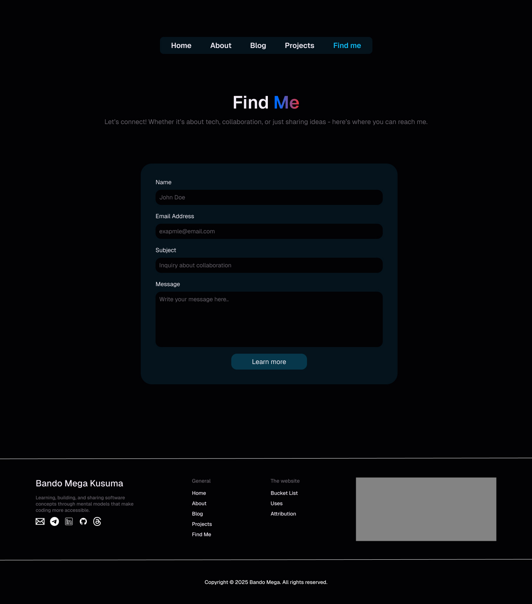

# bandomega.com

## Introduction

Welcome to my personal website project! This website serves as a platform to showcase information about me, my open-source projects, writings, and contact information.

I am developing myself as a full-stack engineer, with a strong focus on frontend development. I enjoy building projects that combine clean design, responsive user interfaces, and solid technical foundations.

## Inspirations

Some of inspiration:

- [theodorusclarence.com](https://www.theodorusclarence.com/)
- [haydenbleasel.com](https://www.haydenbleasel.com/)
- [taniarascia.com](https://www.taniarascia.com/)

## Page

I just create 6 page for visitor to learn about me.

```bash
Site Map

Personal Website (bandomega.com)
├──Home
├──About
├──Blogs
│──Blog Detail
├──Projects
└──Find me
```

### Features

- [Home](#home): Overview of who I am and what I do.
- [About](#blog): About: Shares my background, education, and journey into web development.
- [Projects](#projects): Showcases my personal projects with descriptions, tech stacks, and demo links.
- [Blog](#blog): Blog: Features my writings, tutorials, and learning journey.
- [Blog Details](#blog-details): Displays the full content of a single blog post with related articles.
- [Find me](#find-me): Provides a form and links to connect with me on social media.

## Technologies Used

- HTML5
- Tailwind CSS

## Links

- Website URL: [bandomega.com](www.bandomega.com)
- Github Repo: [github.com/bando9](https://github.com/bando9/bandomega.com)
- Figma File: [www.figma.com/design/tjvpqJnoz2F16NSCxFJBYe/Bandomega.com](https://www.figma.com/design/tjvpqJnoz2F16NSCxFJBYe/Bandomega.com)

### Social Media

- Telegram: [t.me/bandomega](t.me/bandomega)
- LinkedIn: [linkedin.com/in/bando-mega-kusuma](https://www.linkedin.com/in/bando-mega-kusuma)
- GitHub: [github.com/bando9](https://www.github.com/bando9)
- Instagram: [instagram.com/bandomega1](https://www.instagram.com/bandomega1)
- CV/Resume: [bandomega.com](https://www.bandomega.com)

## Preview

### Home


### About


### Projects


### Blog


### Blog Details


### Find me


